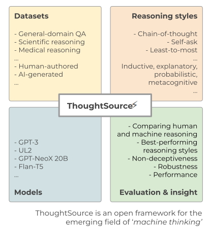
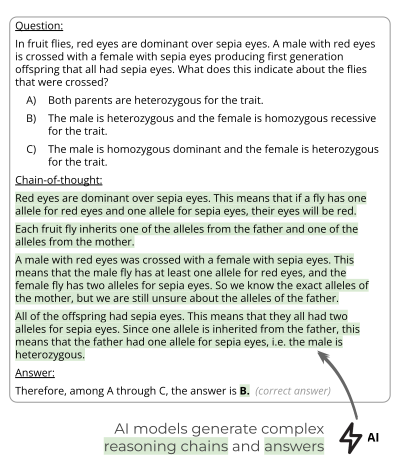
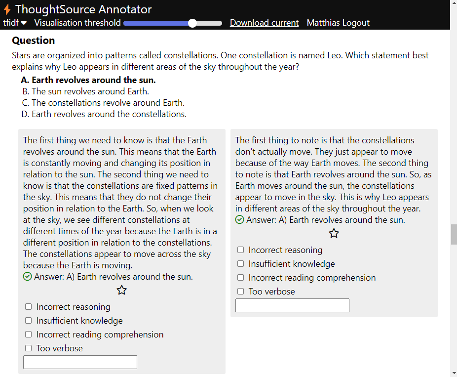

# ThoughtSource⚡
__A framework for the science of machine thinking__

## Overview
- Quickstart
- Scientific introduction
- Tools:
  - Dataset viewer
  - Annotator
- Code explanation
- ? Roadmap

## Quickstart
A <a href="https://colab.research.google.com/drive/1r-mrk2FFXk10qP9UbNJ-Jn6QeMD8SwTo?usp=sharing" target="_blank">tutorial notebook</a> can be accessed.

Access the web-hosted <a href="http://thought.samwald.info/" target="_blank">Dataset viewer</a>

Access the web-hosted <a href="http://thought.samwald.info:3000/" target="_blank">Annotator</a> and <a href="https://github.com/OpenBioLink/ThoughtSource/blob/tutorial/apps/annotator/example_input.json" target="_blank">Example input</a>

# Scientific introduction

ThoughtSource is a central, open resource and community around data and tools related to _chain-of-thought reasoning_ in large language models ([Wei 2022](https://arxiv.org/abs/2201.11903)). Our long-term goal is to enable trustworthy and robust reasoning in advanced AI systems for driving scientific research and development.

<p align="center">
  
</p>

## Generate interpretable reasoning chains
<p align="center">
  
</p>

(the example shown here was generated with the _text-davinci-002_ model)

## Annotate, evaluate and improve
<p align="center">
  
</p>


# Applications

## Annotator
---
<p align="center">
 <a href="http://thought.samwald.info:3000/"><b>Use the web-based annotator 📝</b></a> 
</p>

---
* __[annotator](./apps/annotator):__ Web-based tool for annotating chain-of-thought data. 

<p align="center">
  

  The annotator allows for highlighting similarities between different generated reasoning chains, making it easier to spot strenghts and weaknesses and to select best results.
</p>


## Dataset viewer
 ---
<p align="center">
 Datasets can be <a href="http://thought.samwald.info/"><b>browsed online through the Dataset Viewer 🔎</b></a> 
</p>

---


* __[dataset-viewer](./apps/dataset-viewer/):__ Streamlit application for browsing ThoughtSource datasets

### Current datasets

__Datasets can be [browsed online through the Dataset Viewer 🔎](http://thought.samwald.info/)__. 
 
 Our [dataloaders](./libs/cot/) allow you to access the following datasets in a standardized chain-of-thought format. The dataloaders create objects in the [Hugging Face 🤗 Datasets format](https://huggingface.co/docs/datasets/index). We (sometimes extensively) post-processed the source datasets in different ways to create more coherent reasoning chains.


### General question answering
* __[commonsense_qa](https://www.tau-nlp.sites.tau.ac.il/commonsenseqa):__ Multiple-choice commonsense knowledge question answering dataset ([Talmor 2018](https://arxiv.org/abs/1811.00937), _License:_ MIT).  Reasoning chains from three different sources are included:

  * __Human-generated__ reasoning chains derived from the __[ECQA dataset](https://github.com/dair-iitd/ECQA-Dataset)__ ([Aggarwal 2021](https://aclanthology.org/2021.acl-long.238/)). Used as gold standard. _License:_ Community Data License Agreements Sharing license 1.0.
  * __AI-generated (few-shot prompting)__ reasoning chains from __[Wei 2022](https://arxiv.org/abs/2201.11903)__. Only available for __validation split__. _License:_ Unknown
  * __AI-generated (zero-shot prompting)__  generated reasoning chains from __[Kojima 2022](https://arxiv.org/abs/2205.11916)__. Only available for __validation split__. _License:_ Unknown
* __[strategy_qa](https://allenai.org/data/strategyqa):__ General-domain question-answering data from the StrategyQA dataset, reasoning chains are derived from original dataset. ([Geva 2021](https://direct.mit.edu/tacl/article/doi/10.1162/tacl_a_00370/100680/Did-Aristotle-Use-a-Laptop-A-Question-Answering)). _License:_ MIT.
  * __Human-generated__ reasoning chains derived from the original dataset. Used as gold standard. _License:_ MIT.
  * __AI-generated (few-shot)__ reasoning chains from __[Wei 2022](https://arxiv.org/abs/2201.11903)__. Only available for __train split__. _License:_ Unknown
  * __AI-generated (zero-shot)__  generated reasoning chains from __[Kojima 2022](https://arxiv.org/abs/2205.11916)__. Only available for __train split__. _License:_ Unknown
* __[qed](https://github.com/google-research-datasets/QED):__ General-domain question-answering data and justifications from the QED dataset ([Lamm 2020](https://arxiv.org/abs/2009.06354)). _License:_ CC BY-SA 3.0.

### Scientific question answering
* __[worldtree](http://cognitiveai.org/explanationbank/):__ Scientific question-answering data from the WorldTree v2 dataset ([Xie 2020](https://aclanthology.org/2020.lrec-1.671/)). __Human-generated__ reasoning chains derived from the original dataset. _License:_ AI2 Mercury.
* __[entailment_bank](https://allenai.org/data/entailmentbank):__ Science exam questions with expert-authored explanations from the EntailmentBank dataset ([Dalvi 2022](https://arxiv.org/pdf/2104.08661.pdf)). __Human-generated__ reasoning chains derived from the original dataset. _License:_ CC BY 4.0. (Note: significant overlap with worldtree v2)
* __[open_book_qa](https://allenai.org/data/open-book-qa):__ Scientific question-answering modeled after open book exams for assessing human understanding from the OpenBookQA dataset ([Mihaylov 2018](https://aclanthology.org/D18-1260.pdf)). __Human-generated__ reasoning chains derived from the original dataset. _License:_ Apache License 2.0.
* __[med_qa](https://github.com/jind11/MedQA):__ Free-form multiple-choice OpenQA dataset containing questions from medical board exams in US (USMLE), Mainland China and Taiwan. ([Jin 2020](https://arxiv.org/abs/2009.13081v1)). _License:_ MIT. 
  * __AI-generated (zero-shot)__ reasoning chains derived from __[Liévin 2022](https://arxiv.org/abs/2207.08143)__. Only available for the __test split__, only US questions. _License:_ Unknown.
* __[medmc_qa](https://medmcqa.github.io/):__ Multiple-Choice Question Answering dataset containing real-world medical entrance exam questions from the All India Institute of Medical Sciences (AIIMS PG) and National Eligibility cum Entrance Test (NEET PG). Only available for 1000 samples from the __validation split__. ([Pal 2022](https://arxiv.org/abs/2203.14371)). _License:_ MIT.
  * __AI-generated (zero-shot)__ reasoning chains derived from __[Liévin 2022](https://arxiv.org/abs/2207.08143)__. _License:_ CC-BY.
* __[pubmed_qa](https://github.com/pubmedqa/pubmedqa):__ QA dataset containing biomedical questions extracted from PubMed abstracts that can be answered with yes/no/maybe ([Jin 2019](https://arxiv.org/abs/1909.06146)). _License:_ MIT. 
  * __AI-generated (zero-shot)__ reasoning chains derived from __[Liévin 2022](https://arxiv.org/abs/2207.08143)__. Only available for the __test split__. _License:_ CC-BY.

### Math word problems
* __[aqua](https://github.com/deepmind/AQuA):__ Math word problems from the AQUA-RAT (Algebra Question Answering with Rationales) dataset ([Ling 2017](https://arxiv.org/pdf/1705.04146.pdf)). Reasoning chains derived from the original dataset. _License:_ Apache 2.0.
* __[asdiv](https://github.com/chaochun/nlu-asdiv-dataset):__ Math word problems from the Academia Sinica Diverse MWP dataset ([Miao 2020](https://aclanthology.org/2020.acl-main.92/)). Reasoning chains derived from the original dataset. _License:_ CC BY-NC 4.0.
* __[gsm8k](https://github.com/openai/grade-school-math):__  Math word problems from the GSM8K dataset ([Cobbe 2021](https://arxiv.org/abs/2110.14168)). Reasoning chains derived from the original dataset. _License:_ MIT.
* __[mawps](https://github.com/sroy9/mawps):__ Math word problems from MAWPS, the Math Word Problem Repository dataset ([Koncel-Kedziorski 2016](https://aclanthology.org/N16-1136.pdf)). Reasoning chains derived from the original dataset. _License:_ MIT.
* __[svamp](https://github.com/arkilpatel/SVAMP):__ Math word problems. Source: SVAMP ([Patel 2021](https://aclanthology.org/2021.naacl-main.168/)). Reasoning chains derived from the original dataset. _License:_ MIT.


We are working on collecting and generating additional datasets, and on further improving the quality of existing datasets (see [dataset issues](https://github.com/OpenBioLink/ThoughtSource/issues?q=is%3Aissue+label%3Adataset)). We welcome suggestions for the inclusion of other datasets.

__We welcome dataset contributions! 👉 Have a look at our [contribution guide](CONTRIBUTING.md)!__


# Code

### Installation with virtual environment
execute in terminal line by line:
```bash
git clone git@github.com:OpenBioLink/ThoughtSource.git
cd ThoughtSource
# install pip and virtualenv
sudo apt install python3-pip
sudo apt install python3-venv
# create and activate virtual environment
python3 -m venv venv
source ./venv/bin/activate
# install requirements and API packages
pip install -e ./libs/cot[api]
```

### Libraries

* __[cot](./libs/cot/):__ 
  *  __dataloader__: Creating and processing of ThoughtSource datasets (based on the Hugging Face 🤗 Datasets library).
  * __generate__: Generating reasoning chains with a wide variety of language models (currently OpenAI and models on Hugging Face hub)
  * __evaluate__: Evaluate the performance of predictions extracted using generated reasoning chains
* __[explanatory notebooks](./notebooks/)__: [Overview](./notebooks/0_overview.ipynb), [Datasets](./notebooks/1_dataset.ipynb), [Model](./notebooks/2_generate.ipynb), [Performance](./notebooks/3_evaluate.ipynb)


```python
# 1) Dataset loading and selecting a random sample
collection = Collection(["worldtree"], verbose=False)
collection = collection.select(split="train", number_samples=10)

# 2) Language Model generates chains of thought and then extracts answers
config={
    "instruction_keys": ['qa-01'], # "Answer the following question through step-by-step reasoning."
    "cot_trigger_keys": ['kojima-01'], # "Answer: Let's think step by step."
    "answer_extraction_keys": ['kojima-A-D'], # "Therefore, among A through D, the answer is"
    "api_service": "huggingface_hub",
    "engine": "google/flan-t5-xl",
    "warn": False,
    "verbose": False,
}
collection.generate(config=config)

# 3) Performance evaluation
collection.evaluate()
```
```
{'accuracy': {'qa-01_kojima-01_kojima-A-D': 0.6}}
```


## Roadmap

1. Create a __repository of chain-of-thought (CoT) datasets__ converted to a unified format. ✅
2. Create a library for __generating__ reasoning chains with a wide variety of large language models. ✅
3. Create tools for __diagnosing, annotating and evaluating__ CoT data and fostering empirical understanding. 
4. Create a __conceptual model__ of different CoT reasoning styles and errors.
5. Provide models __fine-tuned on high-quality CoT data__.
6. Apply CoT reasoning to __high-impact use-cases__ such as biomedical research or clinical decision making.


